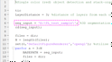
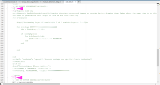

<h1>README</h1>

Author: Haseeb Qureshi, current affiliation: University of Sheffield.

<h3>System requirements & command line command list:</h3>

<b>Linux packages to install to setup python environment: </b>

sudo apt-get install python3 python3-pip python-tk PyQt5 python3-pyqt5

<b>Python packages to install in order for software to work: </b>

pip3 install opencv-python-headless matplotlib numpy scipy scikit-image pillow scikit-learn pandas PySimpleGUI PySimpleGUIQt contextlib gc mayavi

<b>Run program from command line:</b>

python3 sme.py 

<b>3D segmentation: </b>

An installation of MATLAB (any recent version, version 2019 onwards as these are the ones I have tested)

 
<h3>Running the software</h3>
 

The order of the steps for processing an image are 2D segmentation, 3D segmentation, Transformation, Tracking.
2D segmentation goes through each slice of data and detects features.
  
3D segmentation stitches the 2D segments together into 3D objects and extracts geometrical features

These features are transformed into a usable form for Tracking to work on.

 
<b>2D SEGMENTATION</b>

images need to be tiff series, with each time point in its own folder and each z slice as a separate tiff file. 

ImageJ can save a 3D image as tiff series, but doesn't sort the time points into folders. I have script that should do this for you.

Open the a couple of random tiffs in ImageJ and hover the mouse over nuclei and background to get a feel for the brightness levels of the image.

 

Input: Select the parent folder containing the sub folders for each time point.

Output: Select the folder to output the segmentations to.

max nuclear diameter: The largest diameter you would expect to see. This is set to zone to 'colour in' with the watershed. Advisable to overestimate by 10% or so.

Minimal brightness: Brightness to not consider peaks below, however this is made sort of redundant by the 'Peak prominence' parameter. Adjusting this parameter can save processing time, by just not processing features below a particular brightness. However, setting this very low still yeilds acceptable results.

Peak prominence: The minimum brightness a feature is in comparison to its immediate surrounding.

clustering distance: How far apart nuclei are. If unsure, just set the same as max nuclear distance.

Min 2D area: minumum area of feature (noise elimination feature. features below this size are not segmented. If image is low noise and and lacks debris, this can be set lower for better granularity in feature detection)

Max 2D area: maximum area of feature in z slice (features above this side are not segmented, usually to eliminate noise)

Processing cores: How many logical processors to use to perform the task. At most, set to the number of logical processors-1.

 
<b>3D SEGMENTATION</b>

Run x3D_SEG.m in MATLAB. Simply change value of seg_input by changing what it equals to. Enclose directory path in single quotations.

Once this change has been made, run the script. This will output a .csv file per frame, carrying the geometrical data which will be used in the subsequent steps. These will be output into the directory specified by seg_input.

OPTIONAL: To view full 3D output per frame as it is produced, uncomment between "%--3D OUTPUT VISUALISATION BLOCK--" and "%--END 3D OUTPUT VISUALISATION BLOCK--"" by deleting the %{ and %}. WARNING: this visualtion is very RAM heavy, and will take longer to process. depending on your RAM capacity maybe only try this on a few frames at a time, by running the script in a parent folder with a sample of the frames you wish to inspect. This is purely a visual step and does not impact the numerical outputs in any way. The parantheses to remove are highlighted in the following image, with a box and arrow.

 
<b>TRANSFORMTION</b>

Input: Folder in which 3D segmentation outputs (.csv files per time point) are stored

Output: Folder in which the resulting single .csv file with collated time point data is stored.

Min volume filter: Remove features below a certain volume. (can be effective in removing improperly segmented nuclei or small debris)

X conversion: Conversion factor of pixels to microns in x dimension - how many microns are covered by the pixel in this dimension. Available fro examning raw data metadata

Y conversion: Conversion factor of pixels to microns in y dimension - how many microns are covered by the pixel in this dimension. Available fro examning raw data metadata

Z conversion: Conversion factor of pixels to microns in z dimension - how many microns are covered by the pixel in this dimension. Available fro examning raw data metadata

 
 
<b>TRACKING</b>

Filling the Transformation input/output should autofill the relevant tracking input/output (unless you wish to track a separate dataset, in which case you will need to select that manually)

Input: Select the file which resulted from implementing the transformation step. This is usually called 'appendcsv.csv', but if you have renamed it then it will still work when you select it.

Output: Folder to save output csv's in.

Min scan radius: Minimum region within to search for nuclei in the next frame. This typically the cell diameter at the end of your video.

Decay factor: Approx by how much the diameter of cells is decreasing per generation.

Mitosis buffer: How many frames after mitosis do you not expect another mitosis event. This is mainly to give the daughter nuclei from a mitotic event time to migrate away from each other without registering another mitosis. This will generally depend on frame rate. Timelapses with less time between frames will require a higher mitosis buffer value, and vice versa.

 

<h3>bugs and to do:</h3>

console doesn't update when functions are executed, seemingly due to how the multithreading is implemented.

exiting the GUI while a function is executing doesn't kill that process. Need to end process via task/process manager. Need to build in method for killing all child processes on exit.

